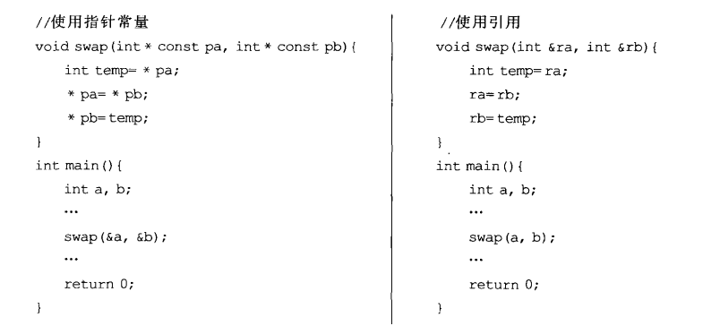
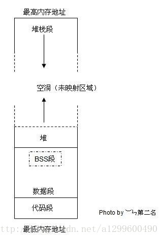
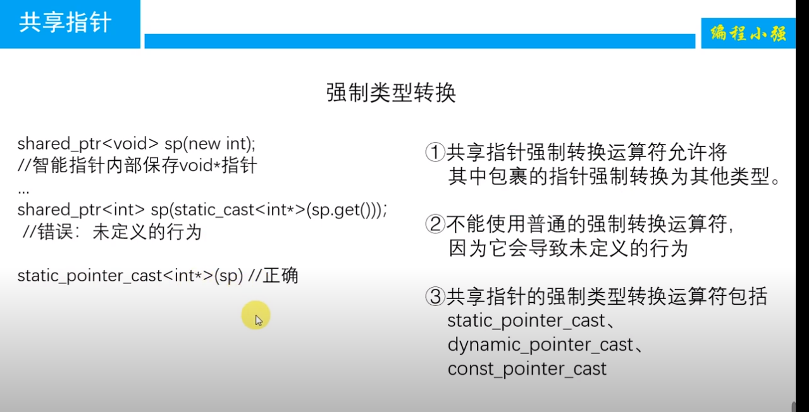
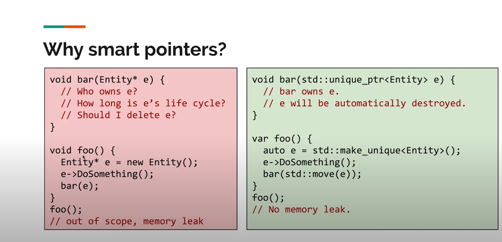
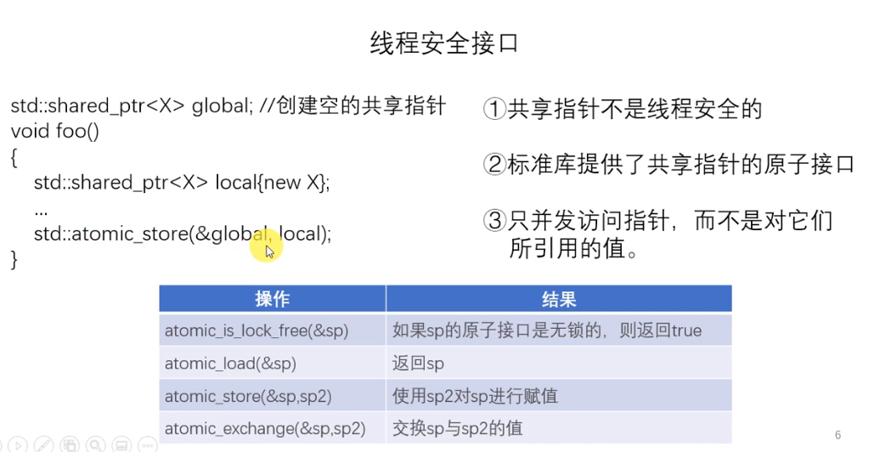
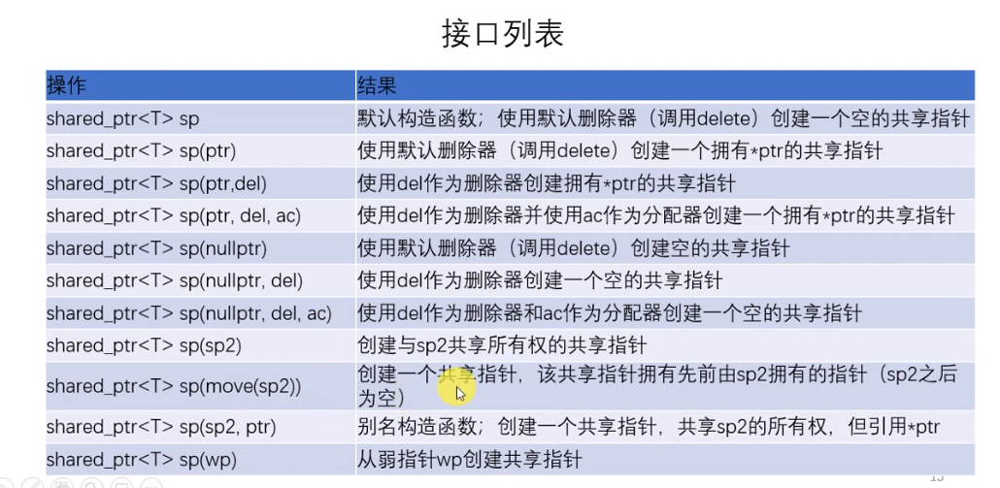
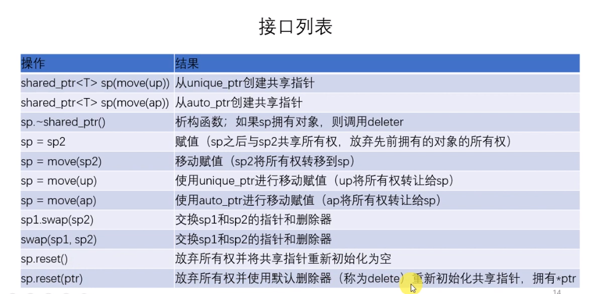
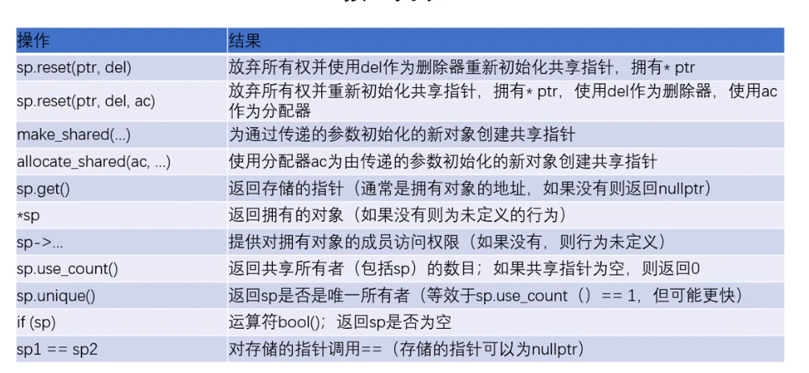
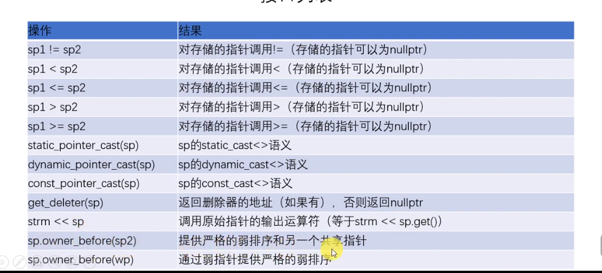

[toc]
# c++ 常见问题
## 可执行文件运行的底层逻辑
可执行文件的运行过程是计算机的复杂操作，涉及多个层次的抽象和多个组件的协作。以下是可执行文件的运行过程的简要步骤，以及计算机如何逐步处理和最终输出执行结果：

1. **加载可执行文件**：
   - 用户启动可执行文件，操作系统加载文件内容到内存中。这包括从磁盘或其他存储介质中读取文件内容，并将其加载到物理内存或虚拟内存中。

2. **解析可执行文件**：
   - 操作系统解析可执行文件的文件头和段表，以了解程序的结构，包括代码段、数据段、入口点等信息。

3. **分配内存空间**：
   - 操作系统为进程分配内存空间，包括栈、堆和全局数据段等。这些内存区域是进程运行时使用的内存。

4. **运行时库初始化**：
   - 运行时库（如C库）被初始化，包括全局变量的初始化和库函数的设置。

5. **跳转到程序入口点**：
   - 控制权被传递到可执行文件的程序入口点（通常是 `main` 函数），执行从这里开始。

6. **程序执行**：
   - 可执行文件中的机器码（二进制指令）被执行，实现程序的各种操作。这包括算术运算、条件判断、循环、函数调用等。

7. **系统调用**：
   - 程序可以通过系统调用请求操作系统提供的服务，如文件I/O、进程管理、内存分配等。程序通过软中断（软件触发的中断）进入内核模式执行系统调用。

8. **硬件交互**：
   - 程序可以与计算机硬件交互，执行各种操作，如访问外部设备、处理输入输出等。

9. **结束程序**：
   - 当 `main` 函数返回或调用 `exit` 函数时，程序的主要执行路径结束。
   - 程序进行清理操作，释放资源、关闭文件、释放内存等。

10. **操作系统清理**：
    - 操作系统接管程序的控制，进行清理工作，如资源释放、进程状态更新等。

11. **输出结果**：
    - 可执行文件的执行结果可以是各种形式的输出，如在屏幕上显示文本、将数据写入文件、发送数据到网络等。

12. **进程终止**：
    - 进程终止，操作系统回收进程的资源，将进程从内存中移除。

整个过程包括了计算机硬件（CPU、内存、外部设备等）、操作系统内核和用户程序之间的协作。计算机硬件执行机器码指令，操作系统管理资源和提供服务，用户程序实现具体的应用逻辑。执行结果可能是在屏幕上显示信息、创建文件、向网络发送数据等，具体取决于程序的目的和逻辑。
## 结构体的内存对齐原则
* 第一个成员首地址为0
* 一个成员都是自身大小的整数倍
* 结构体的总大小以最大的成员属性宽度决定

## define、typedef、const
### define的用法：
\行继续操作， 行继续操作当定义的宏不能用一行表达完整时，可以用 \（反斜线）表示下一行继续此宏的定义。最后一行不要加续行符啊
```c++
define COND_PRINTF(COND,FOR)\
  if(CON){
     CSP_DPRINTF( ALWAYS,LOBSTER,0,FOR); \
  } else { \
        brshellWriteF FORMAT ; \
  }
```


\## 连接操作符 x##y表示x连接y，一般都是有意义的符号的连接
VA_ARGS 宏用来接受不定数量的参数
\#表示字符串化操作符，#define str(s) #s
```c++
#define xstr(s) 
  str(s)#define str(s) #s
  #define foo 4 
  str (foo)     ==> "foo" 
  xstr (foo)     
  		==> xstr (4)     
  		==> str (4)     
  		==> "4"
```
### typedef的用法  
给一个常用的数据类型起一个别名  
`typeof std::map<std:string,std::string> StringMap`  

## 变量的声明和定义（extern/static/const）  

了解变量声明和定义时要先了解一下extern/static/const关键字：  
**extern:**   
用在变量声明中常常有这样一个作用，你在*.c文件中声明了一个全局的变量，这个全局的变量如果要被引用，就放在*.h中并用extern来声明
比如extern int a  
仅仅是一个变量的声明，其并不是在定义变量a，并未为a分配内存空间。变量a在所有模块中作为一种全局变量只能被定义一次，否则会出现连接错误.  
与extern对应的是static被它修饰的全局变量和函数只能在本模块中使用，其不可能被extern"C"修饰  
**static:**   
来声明一个变量的作用有二：(static 表示静态的变量，分配内存的时候, 存储在静态区,不存储在栈上面.)
(1)对于局部变量用static声明，则是为该变量分配的空间在整个程序的执行期内都始终存在。
(2)外部变量用static来声明，则该变量的作用只限于本文件模块。
**const:**   
修饰符可以把对象转变成常数对象，意思就是说利用const进行修饰的变量的值在程序的任意位置将不能再被修改，就如同常数一样使用！任何修改该变量的尝试都会导致编译错误  
**变量的声明：**  
* 一种是需要建立存储空间的。例如：int a 在声明的时候就已经建立了存储空间。
* 另一种是不需要建立存储空间的。 例如：extern int a 其中变量a是在别的文件中定义的。
把建立空间的声明称之为“定义”，而把不需要建立存储空间的声明称之为“声明”

### 常成员函数声明的原则
* 使用mutable关键字
mutable关键字使用的被修饰的成员对象无视“常对象的成员对象被视为常对象”这一语言原则。
* Mutable 须慎重

**变量的定义：**  
变量声明并没有定义变量，类似函数的声明和定义。
我们声明的最终目的是为了提前使用，即在定义之前使用，如果不需要提前使用就没有单独声明的必要，变量是如此，函数也是如此，所以声明不会分配存储空间，只有定义时才会分配存储空间。
## 静态变量什么时候初始化  
static 静态成员变量和全局变量一样存放在全局区域，所以在主程序之前，编译器已经为其分配好了内存。
**c和c++的区别：**  
在C中，初始化发生在代码执行之前，编译阶段分配好内存之后，就会进行初始化，所以我们看到在C语言中无法使用变量对静态局部变量进行初始化，在程序运行结束，变量所处的全局内存会被全部回收。
而在C++中，初始化时在执行相关代码时才会进行初始化，主要是由于C++引入对象后，要进行初始化必须执行相应构造函数和析构函数，在构造函数或析构函数中经常会需要进行某些程序中需要进行的特定操作，并非简单地分配内存。所以C++标准定为全局或静态对象是有首次用到时才会进行构造，并通过atexit()来管理。在程序结束，按照构造顺序反方向进行逐个析构。所以在C++中是可以使用变量对静态局部变量进行初始化的

## 赋值和初始化的区别
对于基本的数据类型差距不大：
```c++
int a = 12; // initialization, copy 0X000C to a  
a = 12;     // assignment, copy 0X000C to a 
```
对于用户自定义的数据类型比如string的c++初始化和赋值差距很大
初始化是定义变量时候赋给变量的值（从无到有）
赋值是以后用到该变量，赋给该变量新的值

## extern “C”的用法
在c++中引用c语言中的函数和变量，在包含c语言文件（假设cExample.h）时需要处理：
```c++
extern "C"
{
    #include "cExample.h"
}

```
## 初始化成员列表
构造函数初始化列表以一个冒号开始，接着是以逗号分隔的数据成员列表，每个数据成员后面跟一个放在括号中的初始化式
```c++
class CExample 
{
  public:    
    t a;    
    loat b;   
    //构造函数初始化列表    
    Example(): a(0),b(8.8) {}    //构造函数内部赋值    
    CExample()   
   {       
      a = 0;        
      b = 8.8;    
   }
};
```
上面的例子中两个构造函数的结果是一样的。上面的构造函数（使用初始化列表的构造函数）显式的初始化类的成员；而没使用初始化列表的构造函数是对类的成员赋值，并没有进行显式的初始化。  
* **C++的类对象创建过程**  
C++ 在创建类时需要经过两个阶段：分配空间（Allocation）和初始化（Initialization）
* **分配空间：**  
创建C++类对象的第一步就是为其分配内存空间。对于全局对象，静态对象以及分配在栈区域内的对象，对它们的内存分配是在编译阶段就完成了，而对于分配在堆区域内的对象，它们的分配是在运行时动态进行的。内存空间的分配过程涉及到两个关键的问题：需要分配空间的大小以及是否有足够的内存空间来满足分配。
* **初始化**  
首先需要区分两个概念：初始化（Initialization）和赋值（Assignment）。初始化早于赋值，它是随着对象的诞生一起进行的。而赋值是在对象诞生以后又给予它一个新的值。  

* **以下情况需要初始化成员列表：**  
* 需要初始化的数据成员是对象的情况（包含继承情况下，通过显示调用父类的构造函数对父类数据成员进行初始化）
* 需要初始化const修饰的类成员
* 需要初始化引用成员数据
* 子类初始化父类的私有成员，需要在（并且只能在）参数初始化列表中显示调用父类的构造函数。

## strlen和sizeof区别 
**strle**n是一个函数，**sizeof**是一个运算符，  
* **sizeof**参数可以是数组、指针、类型、对象、函数等，功能：获得保证能容纳实现所建立的最大对象的字节大小。由于在编译时计算，因此sizeof不能用来返回动态分配的内存空间的大小  
* **strlen(...)** 参数必须是字符型指针（char*）功能：返回字符串的长度。该字符串可能是自己定义的，也可能是内存中随机的，该函数实际完成的功能是从代表该字符串的第一个地址开始遍历，直到遇到结束符'\0'。返回的长度大小不包括'\0'
## c++中string和char*的区别

* string：string是STL当中的一个容器，对其进行了封装，所以操作起来非常方便。  
* char*：char *是一个指针，可以指向一个字符串数组，至于这个数组可以在栈上分配，也可以在堆上分配，堆得话就要你手动释放了。  
string转换为char*：  
`const char* str=sr.c_string();`  

## strlen(str)和str.length()和str.size()的区别
strlen(str)和str.length()和str.size()都可以求字符串长度,返回字符串中字符的长度，不包括‘/0’str.length()和str.size()是同义词，返回同样的值。strlen(str)是用于求字符数组的长度，其参数是char*  
## c++中 . 和 ->  typedef

主要用于访问类的成员，->主要用于类类型的指针访问的成员，而.运算符，主要用于类类型的对象访问类的成员
```c++
1 class A
2 {
3   public :
    int a
4 }
5 A ma;
6 A *p=&ma;
```
指针p应用->来访问成员a，比如p->a,而ma应使用.来访问，比如ma.a区别就在这里，凡是指针就使用->,对象就使用.运算符。
如果定义了一个结构体数组。
```c++
struct student
{
　　int age;

　　char name[100];
};
```
`struct student array[3];`
通过这个数组进行调用这个结构体中的成员的时候，只能使用.而不能使用->。
如果要是让一个指针指向这个数组的话，可以使用->这个符号。

```c++
struct student *p = array;
p->age = 30;
memcpy(p->name,"Jason");
```
这样是可以的。

C 语言提供了 typedef 关键字，您可以使用它来为类型取一个新的名字。下面的实例为单字节数字定义了一个术语 BYTE：

```c++
typedef unsigned char BYTE;
BYTE  b1, b2;
******************************
//jsoncpp.cpp    line:1227
typedef std::stack<Value*> Nodes;      
Nodes nodes_;
//*
typedef std::deque<ErrorInfo> Errors;
Errors errors_;

```
## 野指针和悬空指针
* 野指针是未初始化的指针
* 悬空指针是指针最初指向的内存已经被释放了的一种指针
使用野指针和悬空指针的危害
* 无论是野指针还是悬空指针，都是指向无效内存区域(这里的无效指的是"不安全不可控")的指针。 访问"不安全可控"(invalid)的内存区域将导致"Undefined Behavior"


## 指针和引用
### 指针和引用的区别 
* 指针是一个变量只是变量中存储着指向数据的地址，而引用是变量的别名，是和原来的变量属于同一东西；
* 引用不可以为空创建后必须初始化，指针可以是空NULL
* 指针的值在初始化后可以改变，即指向其它的存储单元，而引用在进行初始化后就不会再改变了
* ”sizeof引用”得到的是所指向的变量(对象)的大小，而”sizeof指针”得到的是指针本身的大小；
* 指针传递属于值传递相当于拷贝了一个值而原本的值是不变的；引用传递属于地址传递，可以改变原有的值；
* 可以通过指向指针的指针作为入参来修改参数

### 关于指针

* **this指针：**  
C++ 规定，在非静态成员函数内部可以直接使用 this 关键字，this 就代表指向该函数所作用的对象的指针  
* **void \*指针**  
未声明类型的指针，可以存放任何指针；  
* **指向指针的指针：**  
指针也是一个变量，值是另一个变量的地址，指针变量本身也有地址&ptr_a，而存储指针变量地址的变量就是该指针的指针`**pptr_a=&ptr_a`
* **指针函数：**  
返回值是一个地址的函数，即本质是一个函数。函数返回类型是某一类型的指针。 
`类型标识符 *函数名(参数表) `  
`int *f(x，y);`  
* **函数指针：**  
```c++
int (*func)(int a, int b); // 声明函数指针
void (*func)(par1,par2)() = printstufffunc;
func(1,2);
```
通过typeof定义多个函数指针：  
```c++
typedef int (*DoubleIntFunction)(double); 
DoubleIntFunction funcPtr; //此时funcPtr就是具有上面类型的函数指针，使用时直接函数指针名=函数名（不带函数参数信息）
```
* **对象指针：**  
类名 *对象指针名 该指针是属于该类数据类型  

```c++
Point *pointPtr;
Point p1;
pointPtr = &p1;
p1->getX(); //对象指针附地址后可以访问该类的成员函数使用"->"
```
  
* **指针数组：**每一个元素都是指针的数组；=-0  

声明：数据类型 *数组名[下标表达式] -->int *pa[3]  
[]优先级高，先与p结合成为一个数组，再由int*说明这是一个整型指针数组，它有n个指针类型的数组元素（优先级：()>[]>*）
* **数组指针（也称行指针）：**
定义 `int (*p)[n];`
()优先级高，首先说明p是一个指针，指向一个整型的一维数组，这个一维数组的长度是n，也可以说是p的步长。也就是说执行p+1时，p要跨过n个整型数据的长度。
如要将二维数组赋给一指针，应这样赋值：

```c++
int a[3][4]; 
int (*p)[4];  //该语句是定义一个数组指针，指向含4个元素的一维数组。  
p=a;       //将该二维数组的首地址赋给p，也就是a[0]或&a[0][0]  
p++;       //该语句执行过后，也就是p=p+1;p跨过行a[0][]指向了行a[1][] 
```
所以数组指针也称指向一维数组的指针，亦称行指针。  
### 关于引用
#### 右值引用

先看一下左值引用：定义引用变量必须初始化，因为引用其实就是一个别名，需要告诉编译器定义的是谁的引用。  
```
int a = 10;
nt &b = a; // 定义一个左值引用变量
b = 20; // 通过左值引用修改引用内存的值
```

c++98中只能操作左值的引用，而不允许为右值建立引用比如 `int &a = 10;`
上述代码是无法编译通过的，因为10无法进行取地址操作，无法对一个立即数取地址，因为立即数并没有在内存中存储，而是存储在寄存器中，可以通过下述方法解决：

```c++
const int &var = 10;
//此时已经相当于同时创建了一个临时变量10
const int temp = 10;
const int &var =tmp;
```
在汇编层面右值引用做的事情和常引用是相同的，即产生临时量来存储常量。但是，唯一 一点的区别是，右值引用可以进行读写操作，而常引用只能进行读操作。

此种引用方式有一个缺陷，即正常情况下只能操作 C++ 中的左值，无法对右值添加引用  

**右值引用**
* 可以取地址的，有名字的，非临时的就是左值
* 不能取地址的，没有名字的，临时的就是右值

`类型 && 引用名 = 右值表达式;`
右值引用用来绑定到右值，绑定到右值以后本来会被销毁的右值的生存期会延长至与绑定到它的右值引用的生存期。


## c++中的内存等问题
### 内存区域划分

* text段(代码段)：存储程序的二进制指令，即程序源码编译后的二进制代码，常量区也位于此，用于存放常量
* data段(数据段)：存储已被初始化的全局变量、常量
* bss（Block Started by Symbol）段：存储未被初始化的全局变量，和data段一样都属于静态分配，在编译阶段就确定了大小，不释放
* stack段（栈空间）：主要用于函数调用时存储临时变量的，这部分的内存是自动分配，自动释放的,对于栈来讲，它的生长方向是向下的，是向着内存地址减小的方向增长。
* heap段（堆空间）：主要用于动态分配，对于堆来讲，生长方向是向上的，也就是向着内存地址增加的方向，C语言中malloc和free操作堆内存

```c++
int a = 0;  //data段
char *p1;   //bss段
void main()
{
    int b;              //栈
    char s[] = “abc”;   //栈
    char *p2;           //栈
    char *p3 = “123456”; //123456{post.content}在常量区，p3在栈上
    static int c = 0;   //全局（静态）初始化区（数据段，因为已初始化）
    p1 = (char *)malloc(10); //分配得来得10字节的区域在堆区
    p2 = (char *)malloc(20); //分配得来得20字节的区域在堆区
    strcpy(p1, “123456”);
    //123456{post.content}放在常量区，编译器可能会将它与p3所指向的”123456”优化成一块
}

```
BSS段的应用：
用cl编译两个小程序如下：
```c++
//程序1:
int ar[30000];
void main(){};

//程序2:
int ar[300000] = {1, 2, 3, 4, 5, 6 };
void main(){};

```
发现程序2编译之后所得的.exe文件比程序1的要大得多。原因就是，一个位于.bss段，而另一个位于.data段，两者的区别在于：全局的未初始化变量存在于.bss段中，具体体现为一个占位符；全局的已初始化变量存于.data段中；而函数内的自动变量都在栈上分配空间。.bss是不占用.exe文件空间的，其内容由操作系统初始化（清零）；而.data却需要占用，其内容由程序初始化，因此造成了上述情况。
### 内存的申请和释放

#### new 和malloc的区别
* new的使用：new 数据类型 (初始化参数列表）返回一个指针，需要delete释放掉，delete 指针名
* malloc的使用：void* malloc（size_t size ）参数size_t size表示动态内存分配空间的大小,malloc返回值一个指针，该指针指向返回值的首地址，失败返回NULL。
` int *p=(int*)malloc(4);  //int*用来讲void类型转化为int型`
* 当不在使用malloc()函数申请的空间之后，应该使用如下函数释放掉这个内存空间：void  free(void *ptr);
* new和malloc的区别：
    * malloc与free是c++/c语言的标准函数，new/delete是C++的运算符。
    * new和delete在对象创建的时候自动执行构造函数，对象消亡之前会自动执行析构函数，c程序只能用malloc/free管理动态内存。
    * new返回指定类型的指针，并且可以自动计算出所需要的大小。malloc必须用户指定大小，并且默认返回类型为void*,必须强行转换为实际类型的指针。
    * malloc申请空间成功返回void*的指针，失败返回NULL；new 申请对象空间成功后返回对象指针，失败会抛异常（成功返回值不同，失败返回的也不同*）
    * malloc开辟的空间如果不够用可以使用realloc来扩大空间，但是new不可以
    * malloc我们知道它是在堆上分配内存的，C++中，对new申请内存位置有一个抽象概念，它为自由存储区，它可以在堆上，也可以在静态存储区上分配，这主要取决于operator new实现细节，取决与它在哪里为对象分配空间。
    * new 在分配内存失败时会抛出std::bad_alloc异常，可以使用try和catch进行异常处理。malloc 在分配内存失败时返回NULL指针，需要手动检查并处理。
#### 什么时候用智能指针什么时候需要手动申请释放 
智能指针是C++中的一个有用工具，用于管理动态分配的内存，以避免内存泄漏和提高代码的安全性。然而，智能指针并不总是适合每种情况，下面是一些使用智能指针的情况以及一些不推荐使用它们的情况：
### NULL和nullptr的区别
C语言中NULL是指空指针，一般定义为函数
#define NULL ((void *)0)

**适合使用智能指针的情况：**

1. **自动内存管理**：智能指针可以自动处理内存的分配和释放，减少了手动内存管理的复杂性，有助于防止内存泄漏。

2. **避免悬挂指针**：智能指针会在不再需要时自动删除关联的对象，因此避免了悬挂指针的问题（指向已释放内存的指针）。

3. **协作并发编程**：在多线程环境中，使用`std::shared_ptr`可以协调对象的所有权，确保在没有引用对象的线程时能够安全地释放内存。

4. **异常安全性**：使用智能指针可以提高代码的异常安全性，因为在发生异常时，智能指针会确保资源得到适当的释放。

5. **避免手动释放内存**：使用智能指针可以避免手动释放内存的错误和忘记释放内存的问题。

**不推荐使用智能指针的情况：**

1. **不需要动态分配内存**：如果你的应用程序主要使用栈上分配的对象，而不是动态分配内存的对象，那么智能指针可能不是必需的，而且可能会引入不必要的复杂性。

2. **性能要求严格**：智能指针会引入一些额外的开销，因为它们需要维护引用计数等信息。如果你的应用程序对性能要求非常严格，可能需要谨慎考虑是否使用智能指针。

3. **与C库和API交互**：与某些C库或API交互时，可能需要手动管理资源，因为这些库不一定与C++智能指针兼容。

## 基类的虚函数表存放在内存的什么区，虚表指针vptr的初始化时间
* 虚函数是在基类声明的虚函数，在派生类中可以重新定义功能，使用final和overrider分别实现无法定义和可以重新定义的作用。virtual void Show (int x); //虚函数
* 定义虚函数的目的是为了允许基类指针来调用子类的这个函数；而纯虚函数才代表函数没有实现；
* 虚表vtable：编译器编译时，发现基类有虚函数，会为每一个类建立一个虚表，用于存放每一个虚函数的地址，若基类和子类都有同一个虚函数且子类未重新定义，此时的两个虚表中该虚函数的地址相同，若子类重新定义了另一个虚函数，则此虚函数在基类和子类中的虚表存放的地址是不同的，由于Base类和Derive类都包含了一个虚函数func()，编译器会为这两个类都建立一个虚表
* 虚指针：为了方便定位虚表引入，在构造函数中记性虚表的创建以及虚表指针的初始化


## 迭代器失效的情况
当使用一个容器的insert或者erase函数通过迭代器插入或删除元素可能会导致迭代器失效，因此我们为了避免危险，应该获取insert或者erase返回的迭代器，以便用重新获取的新的有效的迭代器进行正确的操作
```c++
iter = vec.insert(iter);  
iter = vec.erase(iter);
// 在这里想把大于2的元素都删除for
(autoit=q.begin();it!=q.end();)
{
    if(*it>2) 
    {   
       //q.erase(it); // 这里就会发生迭代器失效
        it=q.erase(it);// 这里会返回指向下一个元素的迭代器，因此不需要再自加了
    }
    else{ 
        it++; 
    }
}
```

迭代器失效的原因是：
因为 vetor、deque 使用了连续分配的内存，erase操作删除一个元素导致后面所有的元素都会向前移动一个位置，这些元素的地址发生了变化，所以当前位置到容器末尾元素的所有迭代器全部失效。
解决方法：
在擦除和添加时返回新的有效的迭代器
```c++
iter = vec.insert(iter);
iter = vec.erase(iter);
```
## 模板函数和模板类的特例化
* 为什么要引入模板类和模板函数？
模板类和模板函数是C++中泛型编程的基础，它们允许我们编写出可以处理多种类型而不必修改代码的函数和

### 模板函数及模板函数

函数模板：是一个用于生成函数的模板类似于T fun(T a,T b)
模板函数：由函数模板生成的一系列函数
```c++
template typename class
// Function Template
template <typename t>
T fun1 (t a, t b)
{
    RETURN A + B;
}
```

则调用期间代码如下：
```c++
fun1<int>(1,2)  //初始化为int fun1(int a,int b) 
fun1<double>(3.3,5.5)  //初始化为double fun1(double a,double b)

```
### 类模板

```c++
template <typename 类型参数>
class 类名{
     类成员声明 
};
或者
template <class 类型参数>
class 类名{
     类成员声明 
};
```
具体实例
```c++
template<typename T>
    class Compare{
    public:
        Compare(T i,T j)
        {
            x = i;
            y = j;
        }
        T max()
        {
            return (x>y) x:y;
        }
    private:
        T x,y;
};

int main()
{
    Compare<int> com1(2,8);
    Compate<double>com2(1.2,23.4);
}
```
### 模板函数模板类的特例化
* 函数特例化：
当特例化一个函数模板时，必须为原模板中的每个模板参数都提供实参。        
使用关键字template后跟一个空尖括号<>，即template <>，以指出我们正在特例化一个模板。
```c++
template <typename T>
void fun(T a)
{
    cout << "The main template fun(): " << a << endl;
}

template <>  // 对int型特例化
void fun(int a)
{
    cout << "Specialized template for int type: " << a << endl;
}

int main()
{
    fun<char>('a');
    fun<int>(10);
    fun<float>(9.15);
    return 0;
}

```

对于除int型外的其他数据类型，都会调用通用版本的函数模板fun(T a)；对于int型，则会调用特例化版本的fun(int a)。

注意，一个特例化版本的本质是一个实例，而非函数的重载。因此，特例化不影响函数匹配。
### 类模板的特例化

```c++

template <typename T>
class Test{
public:
      void print(){
            cout << "General template object" << endl;
      }
};

template<>  // 对int型特例化
class Test<int>
{
public:
    void print()
    {
        cout << "Specialized template object" << endl;
    }
};

int main()
{
    Test<int> a;
    Test<char> b;
    Test<float> c;
    a.print();
    b.print();
    c.print();
    return 0;
}

```

与函数模板不同，类模板的特例化不必为所有模板参数提供实参。我们可以只指定一部分而非所有模板参数，这种叫做类模板的偏特化 或部分特例化（partial specialization）。例如，C++标准库中的类vector的定义：
```c++
template <typename T, typename Allocator>
class vector
{
      /*......*/
};

// 部分特例化
template <typename Allocator>
class vector<bool, Allocator>
{
      /*......*/
};

```

在vector这个例子中，一个参数被绑定到bool类型，而另一个参数仍未绑定需要由用户指定。  
注意，一个类模板的部分特例化版本仍然是一个模板，因为使用它时用户还必须为那些在特例化版本中未指定的模板参数提供实参。


## 什么是默认构造函数和拷贝构造函数和一般构造函数
### 构造函数
是一种特殊的类成员函数，是当创建一个类的对象时，它被调用来对类的数据成员进行初始化和分配内存。
如何不显示声明和定义上面函数，就会产生4个public inline默认构造函数
```c++
A();                  // 默认构造函数
A(const A&);            // 拷贝构造函数
A& operator=(const A& a)   // 拷贝构造函数
~A();                       // 默认析构函数
```
### 默认构造函数
* 当一个类没有定义构造函数时，编译器才生成默认构造函数。
* 当定义类对象没有提供初始化式时，使用默认构造函数进行初始化
* 没有默认构造函数的类的局限
* 具有该类类型成员的类，必须通过构造函数初始化列表进行初始化。
* 该类不能用作动态分配数组(new)的元素类型。
* 使用该类作为元素类型的静态数组，必须显式初始化。
* 不适用于没有提供初始化的容器
*默认构造函数的使用*
```c++
A test();       ×
A test;         √
A test = A();   √ 
```

A a就是通过默认构造函数来创建一个对象
```c++
class A
{
    int m_i;
    Public:
        A() 
        {
	        Cout<<”无参构造函数”<<endl;
        }
        A(int i):m_i(i) {} //初始化列表
}
```
### 拷贝构造函数
用基于同一类的一个对象构造和初始化另一个对象
当没有重载拷贝构造函数时，通过默认拷贝构造函数来创建一个对象
### 如何区分拷贝构造函数
对于一个类X,如果一个构造函数的第一个参数是下列之一:
```c++
X&
const X&
volatile X&
const volatile X&
```
且没有其他参数或其他参数都有默认值,那么这个函数是拷贝构造函数。（拷贝构造函数不能由成员函数模版生成.）
### 拷贝函数什么时候会被调用
在C++中，3种对象需要复制，此时拷贝构造函数会被调用
* 一个对象以值传递的方式传入函数体
* 一个对象以值传递的方式从函数返回  
* 一个对象需要通过另一个对象进行初始化
### 什么时候编译器会生成默认的拷贝构造函数
* 手动调用
* 函数返回类对象
* 函数有类类型参数
* 容器初始化

总结来说就是没有定义拷贝构造函数时而用用到了拷贝构造函数就会调用拷贝构造函数
### 深拷贝和浅拷贝的区别
因为系统提供的默认拷贝构造函数工作方式是内存拷贝，也就是浅拷贝。如果对象中用到了需要手动释放的对象，则会出现问题，这时就要手动重载拷贝构造函数，实现深拷贝。    
下面说说深拷贝与浅拷贝：
* **浅拷贝：**
如果复制的对象中引用了一个外部内容（例如分配在堆上的数据），那么在复制这个对象的时候，让新旧两个对象指向同一个外部内容，就是浅拷贝。    （指针虽然复制了，但所指向的空间内容并没有复制，而是由两个对象共用，两个对象不独立，删除空间存在）
* **深拷贝：**
如果在复制这个对象的时候为新对象制作了外部对象的独立复制，就是深拷贝。  
总结来说，对象中没有手动释放对象的时候，默认构造函数使用的是浅拷贝，当有需要手动释放的对象时，默认构造函数使用的是深拷贝。

```c++
class A
{ 
    int m_i 
     A(const A& other):m_i(other.m_i)
   { 
       cout<<”拷贝构造函数”<<endl;
   }
}
```
* **隐患**
当类有指针类型的成员时，简单拷贝（浅拷贝）将造成两个不同对象的指针指向同一区域，出现访问冲突、多次delete等错误。
大量拷贝构造函数的调用，降低运行效率。
* **解决**
显式定义拷贝构造函数（为指针重新申请内存，并拷贝内存数据 -- 深拷贝）
禁止拷贝（通过成员函数进行赋值,提高运行效率）
### 如何禁止拷贝 
```c++
class Widget
{

private:
   Widget(const Widget&);  // 声明为私有
   Widget& operator=(const Widget&);
}
```

## 为什么析构函数要写成虚函数 构造函数可以虚函数吗  

* 基类指针指向派生类对象，在删除指针时，会调用派生类的析构函数，派生类的析构函数会自动调用基类的析构函数，这样整个派生类的对象会被完全释放。    
如果基类的析构函数不被声明为虚函数，在删除基类指针时，只会调用基类的析构函数，不会调用派生类的析构函数，造成内存泄露。

* 构造函数不能定义为虚函数。在构造函数中可以调用虚函数，不过此时调用的是正在构造的类中的虚函数，而不是子类的虚函数，因为此时子类尚未构造好。
虚函数对应一个vtable(虚函数表)，类中存储一个vptr指向这个vtable。如果构造函数是虚函数，就需要通过vtable调用，可是对象没有初始化就没有vptr，无法找到vtable，所以构造函数不能是虚函数。

## C++中的重载、重写（覆盖）和隐藏的区别
* **函数重载：**
是指同一可访问区内被声明的几个具有不同参数列（参数的类型，个数，顺序不同）的同名函数，根据参数列表确定调用哪个函数，重载不关心函数返回类型。
比如重写test()函数用于不同的输入，
```c++ 
class A{
public:
  void test(int i);
  void test(double i);//overload
  void test(int i, double j);//overload
  void test(double i, int j);//overload
  int test(int i);       //错误，非重载。注意重载不关心函数返回类型。
};
```
* **运算符的重载：**
对于已有的运算符重新定义，赋予另一个功能，运算符重载一般在类中定义，这样就可以在该类中使用已重载的运算符进行相应的操作。需要用到operator函数。
函数返回类型 operator（要重载的运算符）(参数列表)；//这是声明
```c++
 void* ActualClass::operator new(size_t size)｛｝
//例如：
//假设有一个类，名为A
A operator
+(A &a);//重载运算符“+”，此处是函数声明；
A A::operator+(A &a){  //这是具体定义

}//第一个A是函数返回类型，第二个A是该函数属于A类，第三个A是函数形参类型。
```
```c++
// 函数的隐藏：
{
public:
   void fun(double ,int ){ cout << "Base::fun(double ,int )" << endl; }
};
class Derive : public Base
{
public:
   void fun(int ){ cout << "Derive::fun(int )" << endl; }  //将两个参数改写为一个参数，函数将不接受2个参数
};
```
* **函数的重写(覆盖):**
派生类重新定义函数，其函数名，参数列表，返回值类型，所有都必须同基类中被重写的函数一致。    
派生类调用时会调用派生类的重写函数，不会调用被重写函数。重写的基类中被重写的函数必须有virtual修饰。 
```c++
class A{
public:
   virtual void fun(int i){ cout << "Base::fun(int) : " << i << endl;}
};
class Derived : public Base
{
public:
   virtual void fun(int i){ cout << "Derived::fun(int) : " << i << endl;}
};
```

**重载和重写的区别：**
* 范围区别：重载在同一个类中，而重写是不同类中存在继承关系；
* 参数区别：重写和被重写的函数参数一定相同，重载和被重载的参数一定不同；
* virtual的区别：重写的基类必须有virtual修饰，重载则不必
* 隐藏和重载重写的区别：
隐藏是不同类中，参数可以相同也可以不同，当参数不同时，无论基类中的函数是否被virtual修饰，基类函数都是被隐藏的而不是被重写

## C++的多态如何实现 
c++多态的实现是基于虚函数的，在继承体系下，将父类的某一个函数给成虚函数（既加上virtual关键字），在派生类中对这个虚函数进行重写，利用父类的指针或者引用调用虚函数；  
**c++的多态性用一句话概括就是**:在基类的函数前加上**virtual**关键字，在派生类中重写该函数，运行时将会根据对象的实际类型来调用相应的函数，如果对象类型是派生类，就调用派生类的函数，如果对象类型是基类，就调用基类的函数。


## 内联函数
### 什么时内联函数？
内联函数是C++中一种函数，在编译时，编译器会在调用内联函数的地方展开，而不是在运行时调用。       
内联函数是代码被插入到调用者代码处的函数，如同#define宏，内联函数通过避免调用的开销提高效率，尤其通过调用（“过程化集成”）被编译器优化，宏定义不检查函数参数，只是展开且在预处理时进行，内联函数会检查函数参数类型，所以更安全。
### 内联函数和宏定义的区别：
宏定义是有预处理对宏进行替代，而内联是通过编译器控制实现，而且内联函数是真正的函数，只是在需要的时候内联函数会像宏定义一样展开，所以取消了函数的参数压栈，减少了调用的开销，你可以像调用函数一样调用内联函数，而不必担心处理宏的一些问题。
当你定义一个内联函数时，在函数定义前加上 inline 关键字，并且将定义放入头文件：
```c++
inline  void f(int i, char c)      
{      
// ...
} 
```
必须和函数体声明在一起。执行速度确比一般函数的执行速度要快。
* 类中的成员函数与inline
定义在类中的成员函数缺省都是内联的      
如果在类定义时就在类内给出函数定义，那当然最好。    
如果在类中未给出成员函数定义，而又想内联该函数的话，那在类外要加上inline，否则就认为不是内联的。

```c++  
class tableclass{ 
    　private: 
    　　int i,j; 
    　public: 
    　　int add() { 
            return i + j;
        }; 
    　　inline int dec() { 
            return i - j;
        } 
    　　int GetNum(); 
    }

    inline int tableclass::GetNum()
    { 
      return i;
    }
｝
```
**缺点：**
内联函数也有一定的局限性。就是函数中的执行代码不能太多了，如果，内联函数的函数体过大，一般的编译器会放弃内联方式，而采用普通的方式调用函数。这样，内联函数就和普通函数执行效率一样了。

### 构造函数、析构函数、虚函数可否声明为内联函数?
**将构造函数和析构函数声明为inline是没有什么意义的**
需要思考的是构造函数、析构函数、虚函数被声明为inline有意义吗，或者说编译器是否对这些函数真正内联呢 
先来看构造函数和析构函数，参阅Effective C++得知，将构造函数和析构函数声明为inline是没有什么意义的，即编译器并不真正对声明为inline的构造和析构函数内联，因为编译器会在构造和析构函数中添加额外的操作（申请/释放内存，构造/析构对象等），致使构造函数/析构函数并不像看上去的那么精简。
**将虚函数声明为inline，要分情况讨论**
有的人认为虚函数被声明为inline，但是编译器并没有对其内联，他们给出的理由是inline是编译期决定的，而虚函数是运行期决定的，即在不知道将要调用哪个函数的情况下，如何将函数内联呢 
## auto、decltype和decltype(auto)的用法
* **auto**
C++11新标准引入了auto类型说明符，用它就能让编译器替我们去分析表达式所属的类型。和原来那些只对应某种特定的类型说明符(例如 int)不同，auto 让编译器通过初始值来进行类型推演。从而获得定义变量的类型，所以说 auto 定义的变量必须 有初始值:
``` 
auto alue1 = 1;
auto value2 = 2.33;
auto value3 ='a';
```
* **auto和引用**
① 如果表达式是引用类型, 那么auto的类型是这个引用的对象的类型.

```c++
int i = 2, &ri = i;
autok = ri;// k是int类型, 而不是引用类型
```
② 如果要声明一个引用, 就必须要加上&, 如果要声明为一个指针, 既可以加上*也可以不加*

```c++
inti = 3;
auto &refi =i;// refi是一个int类型的引用
auto *p1 = &i;// 此时推断出来的类型是int, p1是指向int的指针
auto p2 = &i;// 此时推断出来的类型是int*, p2是指向int的指针
```
* **关于auto和const**
auto会忽略掉顶层const, 保留底层const.  举例:

```c++
const int i = 5;
autoa = i;// 变量i是顶层const, 会被忽略, 所以b的类型是int
autob = &i;// 变量i是一个常量, 对常量取地址是一种底层const, 所以b的类型是const int *
```
因此, 如果希望推断出的类型是顶层const的, 那么就需要在auto前面加上cosnt:
```c++
const autoc = i;
```
* **关于decltype**

    * 有的时候我们还会遇到这种情况，我们希望从表达式中推断出要定义变量的类型，但却不想用表达式的值去初始化变量。还有可能是函数的返回类型为某表达式的值类型。
    * 在这些时候auto显得就无力了，所以C++11又引入了第二种类型说明符decltype，它的作用是选择并返回操作数的数据类型。在此过程 中，编译器只是分析表达式并得到它的类型，却不进行实际的计算表达式的值。
    * decltype 是C++11标准引入的一个关键字，用于推断表达式的类型，而不是实际计算它。
    * decltype 的主要作用是在编译时获取表达式的类型，通常用于声明变量的类型，函数返回值类型的推断以及模板元编程等。   
    * decltype只是为了推断出表达式的类型而不用这个表达式的值来初始化对象
```c++
/* 1.decltype的使用 */

int x = 42;
decltype(x) y; // 声明变量 y，其类型与 x 相同，即 int。

decltype(func()) sum = x;// sum的类型是函数func()的返回值的类型, 但是这时不会实际调用函数func()
int i = 0;
decltype(i)j = 4;// i的类型是int, 所以j的类型也是int
/* 2。decltype和const */
//不论是顶层const还是底层const, decltype都会保留  
const int i = 3;
decltype(i) j = i;// j的类型和i是一样的, 都是const int
 
/* 3.decltype和引用 */
// ① 如果表达式是引用类型, 那么decltype的类型也是引用

const int i = 3, &j = i;
decltype(j) k = 5;// k的类型是 const int &
// ② 如果表达式是引用类型, 但是想要得到这个引用所指向的类型, 需要修改表达式:

int i = 3, &r = i;
decltype(r+0) t = 5;// 此时是int类型
// ③ 对指针的解引用操作返回的是引用类型

int i = 3, j = 6, *p = &i;
decltype(*p) c = j;// c是int类型的引用, c和j绑定在一起
// ④ 如果一个表达式的类型不是引用, 但是我们需要推断出引用, 那么可以加上一对括号, 就变成了引用类型了

int i = 3;
decltype((i)) j = i;// 此时j的类型是int类型的引用, j和i绑定在了一起
```
## public，protected和private访问和继承权限
我们对C++类三种方式控制权限总结如下，这与Java中的三种对应的访问权限是一样的。


## volatile、mutable和explicit关键字的用法
* **explicit**
放在构造函数前面可以阻止构造函数的隐式类型转换。这样可以避免不必要的错误。
* **violate**
告诉编译器不要去假定这个变量的值，因为它随时可能会改变。这是为了阻止某些编译
器的优化策略直接从上次缓冲在寄存器里读取数据，而不从内存读
* **mutable**
类的const成员函数本来不可以改变类的成员变量的值，但是一旦某个成员变量被mutable修饰，那么const成员函数可以改变它。

## 常量指针和指针常量区别（顶层const和底层const）

（指针）和 const（常量） 谁在前先读谁 ；*象征着地址，const象征着内容；谁在前面谁就不允许改变。
```c++
int a =3;
int b = 1;
int c = 2;
int const *p1 = &b;//const 在前，定义为常量指针
int *const p2 = &c;//*在前，定义为指针常量 
```
* **常量指针:**
<u>本身是一个指针，其指向的是一个常量，该常量不能通过指针改变，</u>但是指针本身不是一个常量，可以通过改变自身的值从而指向另一个常量；指向的地址可以变，但内容不可以重新赋值，内容的改变只能通过修改地址指向后变换
* **指针常量：**
<u>指针本身是常量,它指向的地址是不可改变的，但地址里的内容可以通过指针改变</u>。指向的地址不可以重新赋值，但内容可以改变，必须初始化，地址跟随一生。
* **使用指针常量的必要性和重要性**
    * 使用指针常量可以增加代码的可靠性和执行效率。
    * 增加可靠性：不用担心p被修改或释放导致非预期结果；
    * 增加执行效率：不用在子函数中对p做为空检查可以提高效率

## 进程和线程之间的区别？什么是“线程安全”？
* **进程：**
程序一次执行过程，是程序在执行过程中的分配和管理的基本单元，每一个进程都有自己的地址空间，线程至少有 5 种状态：初始态、执行态、等待态、就绪态、终止态
* **线程：**
线程是CPU调度和分派的基本单位，它可以和同一进程下的其他线程共享全部资源，线程基本不拥有资源，只是拥有一点在运行中必不可少的资源(如程序计数器,一组寄存器和栈)，但是它可与同属一个进程的其他的线程共享进程所拥有的全部资源
一个线程可以创建和撤销另一个线程;同一个进程中的多个线程之间可以并发执行
* **联系：**
线程是进程中的一部分，一个进程可以有多个线程，但线程只能存在于一个进程中
* **区别：**
    * **根本区别：**
进程是操作系统资源调度的基本单位，线程是任务的调度执行的基本单位。根本区别在于它们是不同的操作系统资源管理方式。线程有自己的堆栈和局部变量，但线程之间没有单独的地址空间，一个线程死掉就等于整个进程死掉，所以多进程的程序要比多线程的程序 健壮，但在进程切换时，耗费资源较大，效率要差一些。但对于一些要求同时进行并且又要共享某些变量的并发操作，只能用线程，不能用进程
**开销方面：**  
进程都有自己的独立数据空间，程序之间的切换开销大；线程也有自己的运行栈和程序计数器，线程间的切换开销较小    
**共享空间：**  
进程拥有各自独立的地址空间、资源，所以共享复杂，需要用IPC（Inter-Process Communication，进程间通信），但是同步简单。而线程共享所属进程的资源，因此共享简单，但是同步复杂，需要用加锁等措施  
**重要区别：**  
从逻辑角度来看，多线程的意义在于一个应用程序中，有多个执行部分可以同时执行。但操作系统并没有将多个线程看做多个独立的应用，来实现进程的调度和管理以及资源分配。这就是进程和线程的重要区别    

在Linux中，进行CPU分配是以线程为单位的，一个进程可能由多个线程组成，这时情况更加复杂，但简单地说，有如下关系：  
* 总线程数<= CPU数量：并行运行    
* 总线程数> CPU数量：并发运行 
## 什么是内存池 
在真正使用内存之前，预先申请分配一定数量、大小预设的内存块留作备用。    
当有新的内存需求时，就从内存池中分出一部分内存块，若内存块不够再继续申请新的内存，当内存释放后就回归到内存块留作后续的复用。


## 类占用的字节数如何计算(sizeof) 
* **空类：**
1. 每个实例在内存中都有独一无二的地址。同样空类也会被实例化
    - 没有虚函数：sizeof(数据成员)的和 
    - 有虚函数：sizeof(数据成员)的和+sizeof(V表指针)=4

若类中包含成员，则类对象的大小只包括其中非静态成员经过对齐所占的空间，对齐方式和结构体相同。如：
```c++
class A  {  
	public:  
		int b;  
		float c;  
		char d;  
	};
```
## 如何检测和避免内存泄漏
### 为什么会发生内存泄漏
当一个对象不需要时本应该被回收时，另外一个正在使用的对象持有它的引用从而不能被回收，这导致本应被回收的对象不能被回收而停留在堆内存中，产生了内存泄露。
1. **单例的使用**
由于单例的静态特性使得其生命周期和应用的生命周期一样长，如果一个对象已经不再需要使用了，而单例对象还持有该对象的引用，就会使得该对象不能被正常回收，从而导致了内存泄漏。    
示例：防止单例导致内存泄漏的实例
```c++
// 使用了单例模式
public class AppManager {
   private static AppManager instance;
   private Context context;
   private AppManager(Context context) {
      this.context = context;
   }
   public static AppManager getInstance(Context context) {
      if (instance != null) {
         instance = new AppManager(context);
      }
      return instance;
   }
}
```
2. **非静态内部类创建静态实例造成的内存泄漏**
例如，有时候我们可能会在启动频繁的Activity中，为了避免重复创建相同的数据资源，可能会出现如下写法：
```c++
public class MainActivity extends AppCompatActivity {  
private static TestResource mResource = null;
   @Override
   protected void onCreate(Bundle savedInstanceState) {
      super.onCreate(savedInstanceState);
      setContentView(R.layout.activity_main);
      if(mResource == null){
         mResource = new TestResource();
      }
      //...
   }

   class TestResource {
   //...
   }
}
```

### 避免内存泄露的几种方式
* 计数法：使用new或者malloc时，让该数+1，delete或free时，该数-1，程序执行完打印这个计 数，如果不为0则表示存在内存泄露
* 一定要将基类的析构函数声明为虚函数
* 对象数组的释放一定要用delete []
* 有new就有delete，有malloc就有free，保证它们一定成对出现

**对于C++的内存泄漏，总结一句话：就是new出来的内存没有通过delete合理的释放掉！**

### 检测内存泄露的工具
ASAN/mtrace/
## set_new_handle检测new失败问题
在C++中，当我们使用`new`运算符来动态分配内存时，如果内存不足或者分配失败，`new`会抛出一个`std::bad_alloc`异常。如果我们想要在`new`失败时执行特定的处理逻辑，可以使用`std::set_new_handler`函数来设置一个新的处理函数。

`std::set_new_handler`函数是一个库函数，它允许我们注册一个全局的`new`失败处理函数。该处理函数将在`new`失败时被调用，我们可以在其中进行适当的错误处理、释放其他资源等操作。处理函数的类型是`std::new_handler`。

下面是一个示例代码：

```cpp
#include <iostream>
#include <new>

void handleNewFailure() {
    std::cout << "Failed to allocate memory. Exiting..." << std::endl;
    exit(EXIT_FAILURE);
}

int main() {
    std::set_new_handler(handleNewFailure);

    // 尝试分配一个非常大的内存块，以模拟内存不足的情况
    int* ptr = new int[1000000000000];

    // 如果new失败，handleNewFailure函数将被调用，程序会退出

    return 0;
}
```

在上述代码中，我们使用`std::set_new_handler`函数将`handleNewFailure`函数注册为全局的`new`失败处理函数。当`new`失败时，`handleNewFailure`函数会被调用，并输出一条错误信息，然后退出程序。这样可以确保在`new`分配内存失败时，我们能够捕获和处理这种情况。

需要注意的是，`set_new_handler`函数只会设置一个全局的处理函数，而且只有在内存分配失败时才会被调用。如果我们想要对特定的`new`表达式进行错误处理，可以使用`try-catch`语句来捕获异常。

## __attribute__ ((visibility("default")))
```c++

#include <stdio.h> 
extern "C" void fun1() 
{ 
 printf("in %s\n",__FUNCTION__); 
} 
__attribute__ ((visibility("hidden"))) void fun1();//若编译此文件时使用了参数-fvisibility=hidden，则此行可以省略

```
## 指针与字符串

```c++
typeName * pointName        //声名指针
double *ptr

//应对内存地址赋给指针。可以对变量名应用&运算符，获取内存地址，new运算符返回未命名的内存的地址

pn = &bubble;     //pn的指针指向bubble变量的地址
pc =new char;     //将新分配的char存储器的地址分配给pc
pa new double[30];      //将30数组的第一个元素的地址分配给pa
```

## 数组
### 对象数组
```c++
// Point.h
#ifndef _POINT_H
#define _POINT_H

class Point {
public:
    point();
    Point(int x,int y);
    ~Point();
    void move(int newX,int newY);
    int getX() const {return x;}
    int getY() const {return y;}
    static void showCount();
private:
    int x,y;
};
```
```c++
//Point.cpp
int main () {
    cout << "Entering main...." << endl;
    Point a[2];   //定义一个对象数组
    for (int i =0; i < 2; i++)
        a [i].move(i + 10, i + 20);  //调用move方法
    cout << "Exiting main..." << endl;
    return 0;
}
```
void的类型指针，声明时不确定指向的内存地址存储值的类型，之后要进行强制类型转换
```c++
#include <iostream>
using namespace std;
int main (){
    //!void voidObject;  错，不能声明void类型的变量
    void *pv;
    int i = 5;
    pv  = &i;
    int *pint = static_cast<int *>(pv);
    //void类型指针赋值给int类型指针
    cout << "*pint = " << *pint <<endl;
    return 0;

}
```
### 指针数组
数组的元素是指针型
`point *pa[2];        //由pa[0].pa[1]两个指针组成`
**对象指针**
```
声明形式 
    类名 *对象指针名
    例如：Point a(5,10);
            Point *ptr;
            ptr=&a;
    通过指针访问对象成员
        对象指针名->成员名
        ptr->getx()相当于 (*ptr).getx();
```
```c++
#include <iostream>
using namespace std;
class Point {
pubilc: 
    Point(int x = 0 , int y = 0) : x(x) ,y(y) {     }  //构造函数
    int getX() const { return x;}
    int getY () const {return y;}
private:
    int x,y;
}
int main() {
    Point a (4,5);   //定义并初始化对象a
    Point *p1 = &a; //定义对象指针，用a的地址将其初始化
    cout << p1 ->getX() << endl;     //利用指针访问对象成员
    cout << a.getX()    <<endl;      //利用对象名访问对象成员
    return ();

}
```

**指向类的非静态成员的指针**

* 通过指向成员的指针只能访问公有成员。
* 声明指向成员的指针
    *   声明指向公有数据成员的指针；
        * 类型说明符 类名::*指针名；
    * 声明指向公有函数成员的指针
        * 类型说明符（类名::*指针名）(参数表)；
* 指向数据成员的指针
    * 说明指针应该指向哪一个成员
        * 指针名 = &类名::数据成员名
   * 通过对象名（或者对象指针）与成员指针结合来访问数据成员
       * 对象名.*类成员指针名
        或：
        对象指针名->*类成员指针名

```c ++
int main() {
    Point a(4,5);
    Point *p1 = &a; //声明对象指针并初始化
    int （Point::*functionPtr）() = Point::getX();  //声明成员函数指针并初始化 
    cout << (a.*fumcPtr) () <<endl;              //使用成员函数指针访问成员函数
    cout << (p1 -> *funcPtr)（） << endl;  //使用成员函数指针和对象指针访问成员函数
    cout << a.getX()) << endl;   //使用对象指针访问成员函数
    cout << p1.getX() << endl;  //使用对象指针访问成员函数
    return 0;
}
```

**动态内存申请操作new**
* new 类型名T （初始化参数列表）
* 功能：在程序执行期间，申请用于存放T类型对象的内存空间，并依初值赋以初值
* 结果值：成功：T类型的指针，指向新分配内存；
            失败：抛出异常。

```c++
#include <iostream>
using namespace std;
class Point {
public:
    Point() : x(0), y(0) {
        cout << "Default Constructor called." <<endl;
         }
    Point (int x,int y) : x(0),y(0) {
        cout << "Con called" <<endl;
    }
    ~Point () { cout <<"Des called."<<endl;}
    int getX () const {return x;}
    int getY () const {return y;}
    void move (int newX,int newY){
        x =newX;
        y =newY;
    }
private:
    int x,y;
}

int main() {
    cout << "Step one:"<< endl;
    Point * ptr1 = new Point;   // 动态构造Point对象  调用无参数的构造函数
    delete ptr1;       //删除对象，自动调用析构函数
    
    cout << "step two:" << endl;
    ptr = new Point(1,2);          //调用有参数的构造函数
    delete ptr1;                 //回收ptr指向的目标位置的内存空间回收，分配多少字节就回收多少字节
    
    return 0;
}
```
**申请和释放动态数组**
分配：new 类型名 T [数组长度]
        数组长度可以是任何表达式，在运行时计算。
释放：delete[]数组名P
        释放指针p所指向的数组。p必须用new分配得到的数组首地址。
```c++
#include <iostream>
using namespace std;
class Point{
int main() {
    Point *ptr = new Point[2]; //创建对象数组
    ptr[0].move(5,10);            //通过指针访问数组元素成员
    ptr[1].move(15,20);         //通过指针访问数组元素成员
    cout << "Deleting..." <<endl;
    delete[] ptr;     //释放整个数组地址
    return 0;
}
}
```
```c++
#include <iostream>
#include <cassert>

using namespace std;


class Point {
public:
    Point() : x(0), y(0) {
        cout << "Default Constructor called." <<endl;
         }
    Point (int x,int y) : x(0),y(0) {
        cout << "Con called" <<endl;
    }
    ~Point () { cout <<"Des called."<<endl;}
    int getX () const {return x;}
    int getY () const {return y;}
    void move (int newX,int newY){
        x =newX;
        y =newY;
    }
private:
    int x,y;
};


class ArrayOfPoints
{
private:
    Point *points;
    int size;
public:
    ArrayOfPoints(int size) :size(size){
        points = new Point[size]; 
    };
    ~ArrayOfPoints() {
        cout << "deleting...."<<endl;
        delete [] points;
    }
    Point &element(int index) {
            assert (index >= 0 && index <size);
            return points [index];
    }
};

int main() {
    int count;
    cout << "please enter the count of poits:";
    cin >> count;
    ArrayOfPoints points(count);
    points.element(0).move(5,0);
    points.element(1).move(15,20);
    return 0;
}
```
### 动态创建多维数组
new 类型名T[第一维长度][第二维长度]...;
* 如果内存申请成功，new运算返回一个指向新分配内存首地址的指针，是一个T类型的数组，数组元素的个数为除左边一维外各维下标表达式的乘机
## 强制类型转换操作符 
### static_cast是一个强制类型转换操作符。
强制类型转换，也称为显式转换，C++中强制类型转换操作符有static_cast、dynamic_cast、const_cast、reinterpert_cast四个。
编译器隐式执行的任何类型转换都可以由static_cast来完成，比如int与float、double与char、enum与int之间的转换等。
### reinterpret_cast
reinterpret_cast 是C++中的一个类型转换操作符，用于执行一种非安全的类型转换，允许将一个指针或引用从一种类型转换为另一种类型，即使它们之间没有直接的关系。reinterpret_cast 应该小心使用，因为它不执行类型检查，可能会导致未定义的行为或不安全的操作。
```c++

#include <iostream>
using namespace std;

int main(int argc, char** argv)
{
    int num = 0x00636261;//用16进制表示32位int，0x61是字符'a'的ASCII码
    int * pnum = &num;
    char * pstr = reinterpret_cast<char *>(pnum);
    cout<<"pnum指针的值: "<<pnum<<endl;
    cout<<"pstr指针的值: "<<static_cast<void *>(pstr)<<endl;//直接输出pstr会输出其指向的字符串，这里的类型转换是为了保证输出pstr的值
    cout<<"pnum指向的内容: "<<hex<<*pnum<<endl;
    cout<<"pstr指向的内容: "<<pstr<<endl;
    return 0;
}
```


第6行定义了一个整型变量num，并初始化为0x00636261（十六进制表示），然后取num的地址用来初始化整型指针变量pnum。接着到了关键的地方，使用reinterpret_cast运算符把pnum从int*转变成char*类型并用于初始化pstr。
```c++
double a = 1.999;
int b = static_cast<double>(a); //相当于a = b ;
```
把精度大的类型转换为精度小的类型，static_cast使用位截断进行处理。使用static_cast可以找回存放在void*指针中的值。
```c++
 double a = 1.999;
 void * vptr = & a; 
 double * dptr = static_cast<double*>(vptr); //将指针地址vptr转换为double型 
 c out<<*dptr<<endl;//输出1.999
```

static_cast也可以用在于基类与派生类指针或引用类型之间的转换。然而它不做运行时的检查，不如dynamic_cast安全。static_cast仅仅是依靠类型转换语句中提供的信息来进行转换，而dynamic_cast则会遍历整个类继承体系进行类型检查,因此dynamic_cast在执行效率上比static_cast要差一些。下面是基类指针转换为派生类指针并调用派生类的方法（基类指针应该是指向派生类）：

```c++
int main()
{
//基类指针转为派生类指针,且该基类指针指向基类对象。
ANIMAL * ani1 = new ANIMAL ;
DOG * dog1 = static_cast<DOG*>(ani1);
//dog1->OutPuttype();//错误，在ANIMAL类型指针不能调用方法OutPutType（）；在运行时出现错误。//基类指针转为派生类指针，且该基类指针指向派生类对象

ANIMAL * ani3 = new DOG;
DOG* dog3 = static_cast<DOG*>(ani3);
dog3->OutPutname(); //正确

//子类指针转为派生类指针
DOG *dog2= new DOG;
ANIMAL *ani2 = static_cast<DOG*>(dog2);
ani2->OutPutname(); //正确，结果输出为大黄

//
system("pause");
}
```


## C++ 智能指针


### 智能指针解决问题
**1. 资源泄露(内存泄漏)**
```c++
int main()
{
    int*pTemp =new int;
    *pTemp=1;
    pTemp=new int;  //错误：之前的int内存已经泄露
    delete pTemp;
    
    return 1;
}
```
**2. 迷途指针**
```c++
int main()
{
    int *p1 =new int;
    int *p2=p1;  //p1和p2指向同一个指针
    delete p1;   //p1 p2指向的地址已经被释放
    *p2=1;  //p2指向的内存已经被释放掉，p2成了迷途指针
    
    return 0;
}
```
**3. 野指针**
```c++
int main()
{
    int *pTemp;
    *pTemp= 1; //错误，未对指针进行初始化形成野指针
    return 0;
}
```

### shared_ptr
**shared_ptr的特性：**

* 具有共享话语权
* 当每一个shared_ptr的最后一个所有者被销毁时，关联对象都将被删除（或者关联资源被清除）
* 是C++11提供的一种智能指针类，它足够智能，可以在任何地方都不使用时自动删除相关指针，从而帮助彻底消除内存泄漏和悬空指针的问题。遵循共享所有权的概念，即不同的 `shared_ptr` 对象可以与相同的指针相关联，并在内部使用引用计数机制来实现这一点。
* 每个 `shared_ptr` 对象在内部指向两个内存位置：
    * 指向对象的指针。
    * 用于控制引用计数数据的指针。

**共享所有权如何在参考计数的帮助下工作：**

* 当新的 shared_ptr 对象与指针关联时，则在其构造函数中，将与此指针关联的引用计数增加1。
* 当任何 shared_ptr 对象超出作用域时，则在其析构函数中，它将关联指针的引用计数减1。如果引用计数变为0，则表示没有其他 shared_ptr 对象与此内存关联，在这种情况下，它使用delete函数删除该内存。

**创建**

```c++
shared_ptr<string> pTom{new string("tom")}
shared_ptr<string> pTom;
pTom.reset(new string("tom"));
shared_ptr<string> p_Tom = make_shared<string>("tom")
```
**使用**

```c++
shared_ptr<string> pTom = make_shared<string>("tom");
shared_ptr<string> pJerry{new string("jerry")};

(*pTom)[0] = 'T';//默认第一个字符串替换 t->T
pJerry->replace(0,1."J"); //调用replace方法修改j->J  此时的

vector<shared_ptr<string>> vtWhoCleanRoom;      //声明一个容器用于放置智能指针
vtWhoCleanRoom.push_back(pTom);       //将pTom插入进去
vtWhoCleanRoom.push_back(pJerry);
vtWhoCleanRoom.push_back(pTom);

//此时的vtWhoCleanRoom内容为Tom Jerry Tom

*pTom ="Tomy"      //此时的vtWhoCleanRoom内容为Tomy Jerry Tomy
```
**比较运算符**

```c++
shared_ptr<int> sp_n1 (new int(1));
shared_ptr<int> sp_n2 (new int(2));
shared_ptr<double> sp_nu;
shared_ptr<double> sp_d1(new double(1));

bool bN1LtN2 = sp_n1 < sp_n2;   //ture
bool bN1GtNu =sp_n1 > sp_nu;  //ture
bool bNuEqNu = sp_nu == sp_nu; //ture
bool bN2GtD1 = sp_d1 < sp_n2;   //编译错误           只有同类型的共享指针才能比较
```
**线程安全**


**错误使用**

```c++
class CTest{
public:
    CTest(const string& sName):m_sName(sName){}
    ~CTest(){
    cout << m_sName << "destory"<<endl;
    }
private:
    string m_sName;
}
int main() {
    CTest *p =new CTest("test");
    shared_ptr<CTest>sp1(p);
    shared_ptr<CTest>sp2(p);      //错误
    return 0;                             //报错段错误
}
```
**处理方法**
```c++
class CTest:public enable_shared_from_this<CTest>
{
public:
    CTest(const string & sName):m_sName(sName) {}
    ~CTest(){
    cout <<m_sName <<"destroy"<< endl;
    }
    shared_ptr<CTest>getSharePtr(){
        return shared_from_this();
    } 
private:
    string m_sName;
}

int main()
{
    CTest *p =new CTest("test");
    shared_ptr<CTest> sp1(p);
    shared_ptr<CTest> sp2= p->getSharedPtr();
    return 0;

}
```





```c++
std::shared_ptr<int> p1(new int()); --> std::shared_ptr<Window> thiz(new WindowImplInvalid() );
```
上面这行代码在堆上创建了两块内存：1：存储int。2：用于引用计数的内存，管理附加此内存的 shared_ptr 对象的计数，最初计数将为1。


### weak_ptr

weak_ptr是一种用于解决shared_ptr相互引用时产生死锁问题的智能指针。

如果有两个shared_ptr相互引用，那么这两个shared_ptr指针的引用计数永远不会下降为0，资源永远不会释放。

weak_ptr是对对象的一种弱引用，它不会增加对象的use_count，weak_ptr和shared_ptr可以相互转化，shared_ptr可以直接赋值给weak_ptr，weak_ptr也可以通过调用lock函数来获得shared_ptr。

### unique_ptr 
"拥有“他所指向的对象。与shared_ptr不同，某个时刻只能有一个unique_ptr指向一个给定的对象。当unique_ptr被销毁时，它所指向的对象也被销毁。uniptr_ptr表达的是一种独占的思想。

### p.reset(new int)的用法
m_browserSignal.reset(new BrowserSignal(this));   //将m_broserSignal指针重新设置为属于BrowserSignal类型的指针，可以调用BrowserSignal中的方法
```c++
// unique_ptr::reset example
#include <iostream>
#include <memory>

int main () {
  std::unique_ptr<int> up;  // empty

  up.reset (new int);       // takes ownership of pointer
  *up=5;
  std::cout << *up << '\n';

  up.reset (new int);       // deletes managed object, acquires new pointer
  *up=10;
  std::cout << *up << '\n';

  up.reset();               // deletes managed object

  return 0;
}
```

### boost 中的enable_shared_from_this类原理分析

## 函数模板
```c++
#include <iostream>
using namespace std;

template <typename T>
T abs(T x){
    return x < 0  -x : x;
    }
    
int main (){    
    int n=-5;  
    double d =-5.5;   
    cout << abs(n) << endl;   
    cout << abs(d) << endl;    
    return 0;
 }
```
```c++

#include <iostream>
using namespace std;

template <class T> //定义函数模板
void outputArray(const T *array,int count) {    //接收数组首地址做参数
    for (int i = 0; i < count; i++)
        cout << array[i] << " ";
    cout << endl;
}

int main() {
    const int A_COUNT =8,B_COUNT = 8, C_COUNT = 20;
    int a [A_COUNT] = {1,2,3,4,5,6,7,8};   //定义int数组
    double b [B_COUNT] = {1.1,2.2,3.3,4.4,5.5,6.6,7.7,8.8}; //定义double数组
    char c [C_COUNT] = "Welcome to see you!";   //定义char数组
    
    cout << "a array contains:" << endl;
    outputArray(a,A_COUNT);        //调用函数模板
    cout << "b a array contains:" << endl;
    outputArray(b,B_COUNT);
    cout << "c a array contains:" << endl;
    outputArray(c,C_COUNT);
    return 0;
}

```
### 单链表的结点类模板

```c++
template <class T>
class Node {
private:
    Node<T> *next;
public:
    T data;
    Node(const T& item,Node<T>* next = 0))
    void insertAfter(Node<T> *P);
    Node<T> *deleteAfter();
    Node<T> *nextNode() const;
};
template <class T>
//插入结点
void Node<T>::insertAfter(Node<T> *p){
    //p节点指针域指向当前节点的后继节点
    p->next = next;
    next = p;  //当前节点的指针域指向p
}
//删除结点
Node<T> *Node<T>::deleteAfter(void){
    Node<T> *tempPtr = next;
    if (next == 0)
        return 0;
  next = tempPtr ->next;
  return tempPtr;
}
```

### 栈类模板
```c++
//Stack.h
#ifdef STACK_H
#define STACK_H
#include <cassert>

template <class T,
        int SIZE = 50>
class Stack {
private:
    T list[SIZE];
    int top;
public:
    Stack();
    void push (const T &item);    //入栈
    T pop();                            //出栈
    void clear();
    const T &peek() const;           //观察栈顶元素
    bool isEmpty() const;
    bool isFull() const;  
};
```
计算器程序
```c++
//calculator.h
#ifndef CALCULATOR_H
#define CALULATOR_H
#include "Stack.h"          //包含栈类模板定义文件

class Calulator {       //计算器类
private:
    Stack<double> s;   //操作数栈
    void enter(double num);    //将操作数num压入栈
    //连续将两个操作数弹出栈，放在opnd1和opnd2中
    bool getTwoOperands(double &opnd1, double &opnd2);
    void compute(char op); //执行出操作符op指定的运算
public:
    void run();            //运算计算器程序
    void clear();        //清空操作数栈
};
#endif  //CALCULATOR_H
```
### 插入排序模板
```c++
template <class T>
void insertionSorit(T a[ ],int n){
    int i.j;
    T tmp;
    
    for (int i = 1; i< n; i++){
        int j = i;
        T tmp = a[ i ]
        while (j > 0 && temp < a[j - 1]) {
            a[j]=a[j-1];
            j--;
        }
        a[j]=temp;
    }
}
```
## 文件输入输出
### 构造输出流对象

* 预先定义的输出流对象
    * cout 标准输出
    * cerr标准错误输出，没有缓冲，发送给它的内容立即被输出
    * clog类似于cerr，但是有缓冲，缓冲区满时被输出
* 标准输出换向
```c++
    ofstream fout("b.out");
    streambuf * pOld =cout,rdbuf(fout,rdbuf());
    // ...
    cout.rdbuf(pOld);
    
```
### 文件输出流成员函数

* open函数
    把流与一个特定的磁盘文件关联起来
    需要指定打开方式
* put函数
   把一个字符写到输出流中
* write函数
    把内存中的一块内容写到一个文件输出流中
* seekp和tellp函数
    操作文件流的内部指针
* close函数
    关闭与一个文件输出流关联的磁盘文件
* 错误处理函数
    写道一个流是进行错误处理
 
 向文件中输出
```c++
#include <fstream> 

using names space std;

struct Date {
    int mondy,day,year;
};

int main (){
    Date
}
```

QT用法总结：
1.QLabel用法：

1.void setText(QString); //设置label框内的文本.
2.void hide(); //隐藏label框.
3.void setBuddy(QWidget*); //把另一个部件设为label框的伙伴，方便快捷使用.
4.void clear(); //清空label框内所有内容.
5.void setPixmap(QPixmap(QString)); //设置图片.
6.void setMovie(QMovie*); //设置电影.
7.void setScaledContents(bool); //设置是否按比例填充满整个label框(非常重要)
8.void setToolTip(QString); //设置信息提示,鼠标放在label框上面会自动跳出文字.
9.void setToolTipDuration(int); //设置信息提示的持续时间，单位是毫秒.
10.void setAlignment(Qt::Alignment); //设置label框的对齐格式.
11.void setStyleSheet(QString); //设置label框的样式.

## std::move 是什么 
它唯一的功能是将一个左值强制转化为右值引用，继而可以通过右值引用使用该值，以用于移动语义。表面看就是将一个对象的值转移到另一个对象，切之前对象的值变为空。
```c++

#include <iostream>#include <utility>#include <vector>#include <string>
 
int main(){
    std::string str = "Hello";
    std::vector<std::string> v;
 
    // uses the push_back(const T&) overload, which means 
    // we'll incur the cost of copying str
    v.push_back(str);
    std::cout << "After copy, str is \"" << str << "\"\n";
 
    // uses the rvalue reference push_back(T&&) overload, 
    // which means no strings will be copied; instead, the contents
    // of str will be moved into the vector.  This is less
    // expensive, but also means str might now be empty.
    v.push_back(std::move(str));
    std::cout << "After move, str is \"" << str << "\"\n";
 
    std::cout << "The contents of the vector are \"" << v[0]
                                         << "\", \"" << v[1] << "\"\n";}
```

Possible output:
`After copy, str is "Hello"`
`After move, str is ""`
`The contents of the vector are "Hello", "Hello"`
## 分别说一下左值、右值、左值引用、右值引用的区别

左值一开始在 C 中定义为“可以出现在赋值操作左边的值”。然而，当 ISO C 加入 const 关键字后，这个定义便不再成立。
可赋值的左值被称为 可修改左值 (modifiable lvalues) 
***左值可以转化成右值但是右值不能转化为左值。***


不过，右值可以通过一些更显式的方法产生左值。例如，一元解引用操作符 '*' 需要一个右值参数，但返回一个左值结果。考虑这样的代码：
```c++
int arr[] = {1, 2};
int* p = &arr[0];
*(p + 1) = 10;   // 正确: p + 1 是右值，但 *(p + 1) 是左值
```

相反地，一元取地址操作符'&'需要一个左值参数，返回一个右值：
```c++

int var = 10;int* bad_addr = &(var + 1); // 错误: 一元 '&' 操作符需要左值参数
int* addr = &var;           // 正确: 
var 是左值&var = 40;                  // 错误: 赋值操作的左操作数需要是左值
```


 左值引用
左值引用的基本语法：type &引用名 = 左值表达式；
右值引用
    右值引用的基本语法type &&引用名 = 右值表达式
    右值引用在企业开发人员在代码优化方面会经常用到。
    右值引用的“&&”中间不可以有空格。
待补充

## 什么是开放递归
## 常用的设计模式
### 单例模式

#### 懒汉模式
#### 饿汉模式
### 工厂模式
